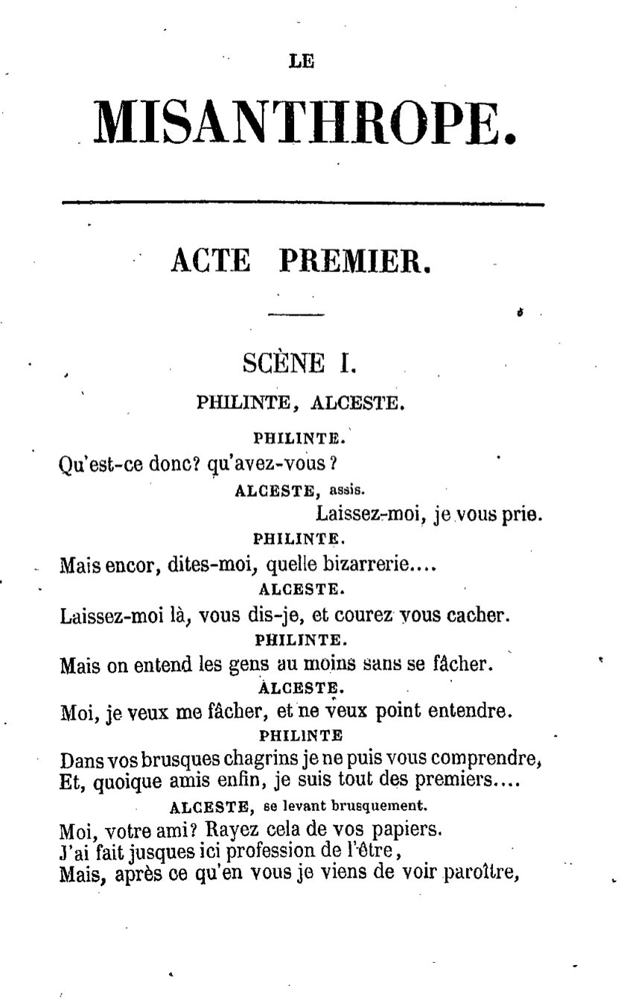

XML – introduction
===

Pour les exercices, on utilise l’éditeur [Atom](https://atom.io/).
* linter-autocomplete-jing
* linter-ui-default

Installer
* `linter` (avec ses dépendances: `linter-ui-default`, avec ses dépendances: `intentions`, `busy-signal`)
* pour autocomplétion, pas top: `linter-autocomplete-jing`


# eXtensible Markup Language
* [X**ML**](https://fr.wikipedia.org/wiki/Extensible_Markup_Language) : **Markup Language**, XML est un langage à balises.
* **X**ML : XML est **eXtensible**  
→ permet de définir différents “espaces de noms” (***namespace***)
* XML ne propose pas un jeu prédéfini et fermé de balises, mais des règles sur ce
que doit être un document **bien formé** et **valide**.
* Objectifs : faciliter l’échange de contenus
* Principes :
  * la structure d’un document XML est définie et validable par un **schéma** ;
  * un document XML est transformable en un autre document XML.

# CONFORMITÉ XML

## Premier document XML
```xml
<?xml version="1.0" encoding="UTF-8"?>
<document xmlns="URI/de/mon/espace-de-nom">
  <métadonnées>
    <auteur>Vincent</auteur>
    <date when="2017-11">novembre 2017</date>
    <titre>Du texte brut aux balises</titre>
  </métadonnées>
  <texte>
    <partie>
      <titre>Texte brut</titre>
      <paragraphe>Le texte brut (<locEtrangere xml:lang="en">plain text</locEtrangere>) représente le contenu basique et échangeable et inter-opérable du texte.</paragraphe>
      <paragraphe>...</paragraphe>
    </partie>
    <partie>
      <titre>Langages de balise</titre>
      <paragraphe>Les langages de balises (<locEtrangere xml:lang="en">Markup Languages</locEtrangere>) permettent l'enrichissement d'information textuelle.</paragraphe>
      <paragraphe>...</paragraphe>
    </partie>
  </texte>
</document>
<document>
```
## Balise, élément
**Balise**
* balise ouvrante : `<titre>`
* balise fermante : `</titre>`
* NB : une balise peut contenir d’autres balises.

**Élément**
* `<titre>Première partie</titre>`
* = balise ouvrante + contenu + balise fermante.

**Syntaxe**
* Les noms des balises **doivent** commencer par une lettre ou "`_`", les caractères suivants peuvent être des chiffres, des lettres, "`_`", "`.`" ou "`-`".
* **La casse est signifiante**. Les balises peuvent être en majuscules ou en minuscules (ou les deux) : les balises `<titre>`, `<Titre>` et `<TITRE>` ne sont pas les mêmes.

**Nœud de type texte** : “Première partie”

## Attribut
`xmlns="URI/de/mon/espace-de-nom"`  
`when="2017-11"`  
`xml:lang="lat"`
* Une paire nom="valeur", intégrée à la balise
* Séparé du nom de la balise par une espace
* Valeur de l’attribut entre *double quotes* : "valeur"

## Document bien formé (règles XML)
### Déclaration XML
Un document XML commence par la **déclaration XML** (`<?xml version="1.0" encoding="UTF-8"?>`) qui précise :
  * la version de la norme XML (`version="1.0"`) ;
  * éventuellement l’encodage utilisé (`encoding="UTF-8"`), **par défaut UTF-8**.

### Élément racine
Le document contient un **UNIQUE élément racine** (ici `document`).  
L’élément racine précise aussi l’**espace de noms** (`namespace`) utilisé (`xmlns="URI/de/mon/espace-de-nom"`).

### Fermeture des balises
**Toute balise ouverte doit être refermée** : (`<texte>` est refermée avec `</texte>`).  
Si une balise est **vide** (si elle ne contient pas de texte), elle peut être simplifiée en une **balise auto-fermante** : en TEI, on écrit `<pb/>` pour `<pb></pb>` ("*page beginning*").

### Imbrication
**Les balises doivent-être imbriquées** : une balise ouverte ne peut pas être fermée tant que toutes les balises incluses dedans n’ont pas été fermées.  
Autrement dit, les balises ne peuvent pas se "chevaucher".  
**NON CONFORME (PAS BIEN) :**
```xml
<a>
  <b>
</a>
  </b>
```
**CONFORME (BIEN) :**
```xml
<a>
  <b>
  </b>
</a>
```

## Un arbre
Un document XML représente syntaxiquement un arbre.
> TODO: dessiner l’arbre du document

## <span style="color:orange">Exercice – Écrire un premier document XML</span>
>Baliser la première page du Misanthrope
* De quels éléments avons-nous besoin pour encoder le début de cette scène ?
* Comment ces éléments vont-ils s’imbriquer ?



## <span style="color:orange">Exercice – Conformité XML</span>
> Ouvrir le fichier dans Oxygen.  
Faire des erreurs de syntaxe.  
Comprendre ce qu’est un fichier bien formé.

```xml
<?xml version="1.0" encoding="UTF-8"?>
<piece xml:lang="fr">
  <titre>LE MISANTHROPE.</titre>
  <acte>
    <titre>ACTE PREMIER</titre>
    <scene>
      <titre>SCÈNE 1.</titre>
      <personnages>PHILINTE, ALCESTE</personnages>
      <tourDeParole>PHILINTE.</tourDeParole>
      <vers>Qu'est-ce donc? qu'avez-vous ?</vers>
      <tourDeParole>ALCESTE<didascalie>, assis</didascalie>.</tourDeParole>
      <vers aligner="droite">Laissez-moi, je vous prie.</vers>
      <tourDeParole>PHILINTE.</tourDeParole>
      <vers>Mais encor, dites-moi, quelle bizarrerie....</vers>
      <tourDeParole>ALCESTE.</tourDeParole>
      <vers>Laissez-moi là, vous dis-je, et courez vous cacher.</vers>
      <tourDeParole>PHILINTE.</tourDeParole>
      <vers>Mais on entend les gens au moins sans se fâcher.</vers>
      <tourDeParole>ALCESTE.</tourDeParole>
      <vers>Moi, je veux me fâcher, et ne veux point entendre.</vers>
      <tourDeParole>PHILINTE</tourDeParole>
      <vers>Dans vos brusques chagrins je ne puis vous comprendre,</vers>
      <vers>Et quoique amis enfin, je suis tout des premiers....</vers>
      <tourDeParole>ALCESTE<didascalie>, se levant brusquement</didascalie>.</tourDeParole>
      <vers>Moi, votre ami? Rayez cela de vos papiers.</vers>
      <vers>J'ai fait jusques ici profession de l'être,</vers>
      <vers>Mais, après ce qu'en vous je viens de voir paraître,</vers>
    </scene>
  </acte>
</piece>
```


# VALIDITÉ XML

XML ne propose pas de balises prédéfinies. La structure d’un document doit être spécifiée :
* quelles balises ? quels attributs ?
* quelles sont les règles d’imbrication de ces balises ?

Langages de schéma
* [DTD (Document Type Definition)](https://fr.wikipedia.org/wiki/Document_Type_Definition)
* [Relax-NG](https://fr.wikipedia.org/wiki/Relax_NG)
* XML Schéma (XSD), Schematron, ODD...

## <span style="color:orange">Exercice – Schéma et validité XML</span>
Rédiger un petit paragraphe libre pour spécifier le schéma que nous avons défini intuitivement pour notre scène.
* formaliser une DTD ;
* ajouter cette DTD à notre transcription ;
* modifier le nom / la casse d’un élément ;
* ajouter une scène, un acte ;
* quels bénéfices tirons-nous de la validation ?
* Pouvons-nous échanger nos fichiers ?

<!--
piece : élément racine ; un titre puis des actes
acte : un titre puis des scènes
scene : un titre, un casting suivis de plusieurs groupes (tours de parole, 1 ou plusieurs vers)
titre : du texte
casting : du texte
tourDeParole : du texte mêlé éventuellement avec une didascalie
didascalie : du texte
vers : @aligner, du texte
@aligner: décrire l’alignement
-->


```xml
<!DOCTYPE piece [
  <!ELEMENT piece (titre, acte+)><!-- Une pièce a un titre, un ou plusieurs actes. -->
  <!ATTLIST piece xml:lang CDATA #REQUIRED><!-- Une pièce a un attribut langue. -->
  <!ELEMENT acte (titre, scene+)><!-- Un acte a un titre, une ou plusieurs scènes. -->
  <!ELEMENT scene (titre, casting, (tourDeParole, vers+)+)><!-- Une scène a un titre, zéro à plusieurs personnages, des vers, des tours de paroles, et ce, à l’infini. -->
  <!ELEMENT titre (#PCDATA)><!-- Le titre, c’est du texte (Parsed Character Data). -->
  <!ELEMENT casting (#PCDATA)><!-- Le personnage, c’est du texte. -->
  <!ELEMENT tourDeParole (#PCDATA | didascalie)*><!-- Le tour de parole, c’est du texte ou un élément didascalie. -->
  <!ELEMENT didascalie (#PCDATA)><!-- Une didascalie c’est du texte. -->
  <!ELEMENT vers (#PCDATA)><!-- Un vers, c’est du texte -->
  <!ATTLIST vers aligner (droite|centre) #IMPLIED><!-- On peut spécifier l’alignement d’un vers, sinon, c’est implicite. -->
]>
```
